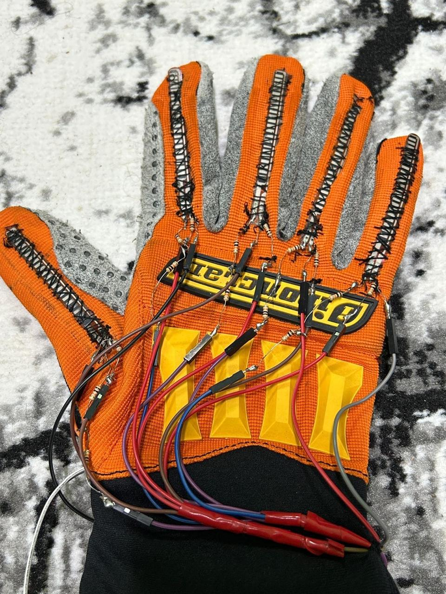
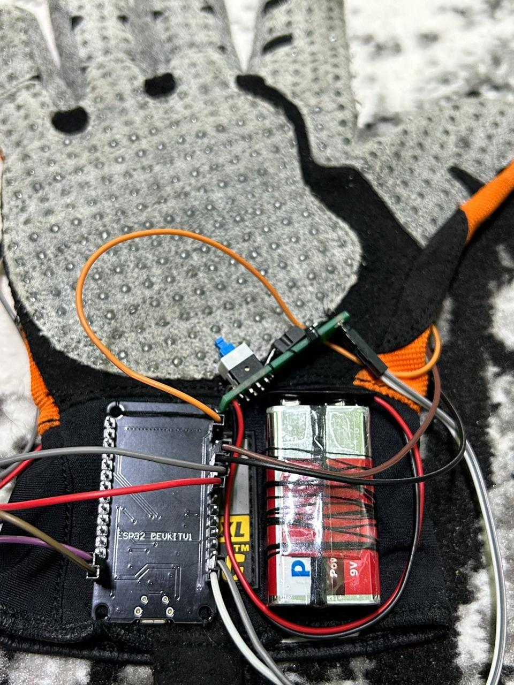

# 🧤 Sign Language Smart Glove Translator  

---

## 📖 Overview  
The **Sign Language Smart Glove Translator** is an innovative wearable system designed to bridge the communication gap for the deaf and mute community.  
It translates **sign language gestures into text in real time** using **IoT, AI, and wearable technology**.  

---

## ✨ Features  
- 🧤 **Smart Glove with Flex Sensors** – Captures finger bending and gestures.  
- ⚡ **ESP32 Microcontroller** – Handles processing and Wi-Fi communication.  
- 🤖 **Random Forest ML Model (92% accuracy)** – Deployed on **Heroku** with **FastAPI**.  
- 📱 **Flutter Mobile App** – Real-time text display, Arabic support, dark mode, and text-to-speech (TTS).  
- ☁️ **Cloud Integration** – Reliable communication using Wi-Fi + HTTP protocols.  

---

## 🛠️ Tech Stack  
| Layer          | Technology |
|----------------|------------|
| **Hardware**   | ESP32, Flex Sensors, Resistors, Battery Kit |
| **IoT**        | Wi-Fi (IEEE 802.11), HTTP, TCP/IP |
| **Backend**    | FastAPI, Python, Scikit-learn, Heroku |
| **Machine Learning** | Random Forest Classifier |
| **Mobile App** | Flutter, Dart, Flutter TTS, HTTP Client |

---

## Images 
-

-

---

## 📊 Results  
- ✅ Achieved **92% accuracy** with Random Forest model.  
- ⚡ Real-time sign-to-text translation with minimal latency.  
- 🔋 Optimized for **low power consumption** and **user comfort**.  

---

## 📑 Documentation  
Full project documentation available here:  
📄 [Smart_Gloves_Documentation.pdf](./docs/Smart_Gloves_Documentation.pdf)  

---

## 👥 Contributors  
- Malak Mohamed Abd-ElHamid  
- Hager Mahmoud Barkat Taghyan  
- Youstina Samy Thabet  
- Hagar Soliman Hamdan  
- Hana Hany Fathy  
- Rana Saeed Elsayed Badr  
- Ahmed Waleed Abd-ElGhaffar  
- Ahmed Mohamed Ramadan  

---

## 🧑‍🏫 Supervisor  
**Dr. Fatma Sakr**  

---

## 🌍 License  
This project is licensed under the **MIT License** – feel free to use, modify, and share with attribution.  

---

⭐ If you find this project useful, please **give it a star** on GitHub!
